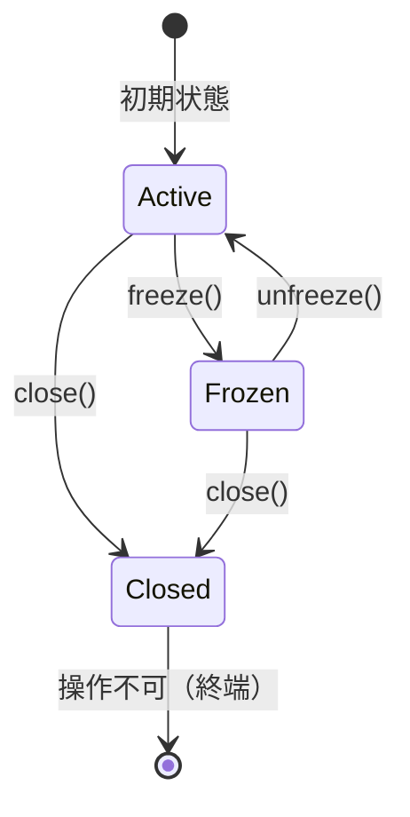

# 状態変化をテストする
本稿では、銀行口座(BankAccount)ドメインを題材に、テスト駆動開発(TDD)を通じて実装を進めながら、状態に応じて振る舞いが変わる仕様に対応し、最終的にStateパターンによる設計改善へ至るプロセスを記します。

## 銀行口座クラスをTDDで開発する

### 要件一覧
- 銀行口座は初期残高を持つ。
- 入金により残高が増加する。
- 出金により残高が減少する。
- 残高不足時には出金できず、例外をスローする。
- 口座が凍結されている場合は出金できない。
- 閉鎖された口座は一切の操作を受け付けない。

## Step 1: 初期残高の取得
### Red🔴： 失敗するテストを書く
#### `bankAccount.test.ts`
```ts
import { BankAccount } from '../../src/domain/bankAccount';

describe('銀行口座', () => {
  test('初期残高が取得できる', () => {
    const account = new BankAccount(1000);
    expect(account.getBalance()).toBe(1000);
  });
});
```
### Green🟢: テストを通すコードを書く
#### `bankAccount.ts`
```ts
export class BankAccount {
  private balance: number;

  constructor(initialBalance: number) {
    this.balance = initialBalance;
  }

  getBalance() {
    return this.balance;
  }
}
```

## Step 2: 入金による残高増加

### Red🔴： 失敗するテストを書く
#### `bankAccount.test.ts`
```ts
import { BankAccount } from '../../src/domain/bankAccount';

describe('銀行口座', () => {
  test('初期残高が取得できる', () => {
    const account = new BankAccount(1000);
    expect(account.getBalance()).toBe(1000);
  });

  test('入金ができる', () => {
    const account = new BankAccount(1000);
    account.deposit(500);
    expect(account.getBalance()).toBe(1500);
  });
});
```
### Green🟢: テストを通すコードを書く
#### `bankAccount.ts`
```ts
export class BankAccount {
  private balance: number;

  constructor(initialBalance: number) {
    this.balance = initialBalance;
  }

  getBalance() {
    return this.balance;
  }

  deposit(amount: number) {
    this.balance += amount;
  }
}
```

## Step 3: 出金による残高減少
### Red🔴： 失敗するテストを書く
#### `bankAccount.test.ts`
```ts
import { BankAccount } from '../../src/domain/bankAccount';

describe('銀行口座', () => {
  test('初期残高が取得できる', () => {
    const account = new BankAccount(1000);
    expect(account.getBalance()).toBe(1000);
  });

  test('入金ができる', () => {
    const account = new BankAccount(1000);
    account.deposit(500);
    expect(account.getBalance()).toBe(1500);
  });

  test('出金ができる', () => {
    const account = new BankAccount(1000);
    account.withdraw(300);
    expect(account.getBalance()).toBe(700);
  });
});
```
### Green🟢: テストを通すコードを書く
#### `bankAccount.ts`
```ts
export class BankAccount {
  private balance: number;

  constructor(initialBalance: number) {
    this.balance = initialBalance;
  }

  getBalance() {
    return this.balance;
  }

  deposit(amount: number) {
    this.balance += amount;
  }

  withdraw(amount: number) {
    this.balance -= amount;
  }
}
```

## Step 4: 残高不足時の例外スロー
### Red🔴： 失敗するテストを書く
#### `bankAccount.test.ts`
```ts
import { BankAccount } from '../../src/domain/bankAccount';

describe('銀行口座', () => {
  let account: BankAccount;
  beforeEach(() => {
    account = new BankAccount(1000);
  });

  test('初期残高が取得できる', () => {
    expect(account.getBalance()).toBe(1000);
  });

  test('入金ができる', () => {
    account.deposit(500);
    expect(account.getBalance()).toBe(1500);
  });

  test('出金ができる', () => {
    account.withdraw(300);
    expect(account.getBalance()).toBe(700);
  });

  test('残高不足なら例外が発生する', () => {
    account = new BankAccount(500);
    expect(() => account.withdraw(1000)).toThrow('残高不足');
  });
});
```

### Green🟢: テストを通すコードを書く
#### `bankAccount.ts`
```ts
export class BankAccount {
  private balance: number;

  constructor(initialBalance: number) {
    this.balance = initialBalance;
  }

  getBalance() {
    return this.balance;
  }

  deposit(amount: number) {
    this.balance += amount;
  }

  withdraw(amount: number) {
    if (amount > this.balance) {
      throw new Error('残高不足');
    }
    this.balance -= amount;
  }
}
```

### Refactor🔵: リファクタリングを行う
#### `bankAccount.test.ts`

- テストを整理（describe ブロック）
- マジックナンバーを定数に
- 状態遷移のログを付けたくなったら、別クラスに責務分離も検討

```ts
import { BankAccount } from '../../src/domain/bankAccount';

describe('BankAccount クラスのテスト', () => {
  const INITIAL_BALANCE = 1000;

  let account: BankAccount;

  beforeEach(() => {
    account = new BankAccount(INITIAL_BALANCE);
  });

  test('初期残高が取得できる', () => {
    expect(account.getBalance()).toBe(INITIAL_BALANCE);
  });

  test('入金ができる', () => {
    account.deposit(500);
    expect(account.getBalance()).toBe(INITIAL_BALANCE + 500);
  });

  test('出金ができる', () => {
    account.withdraw(300);
    expect(account.getBalance()).toBe(INITIAL_BALANCE - 300);
  });

  test('残高不足なら例外が発生する', () => {
    expect(() => account.withdraw(INITIAL_BALANCE + 1)).toThrow(
      BankAccount.INSUFFICIENT_FUNDS
    );
  });
});
```

#### `bankAccount.ts`
```ts
export class BankAccount {
  private balance: number;
  static readonly INSUFFICIENT_FUNDS = '残高不足';

  constructor(initialBalance: number) {
    this.balance = initialBalance;
  }

  getBalance(): number {
    return this.balance;
  }

  deposit(amount: number): void {
    this.balance += amount;
  }

  withdraw(amount: number): void {
    if (amount > this.balance) {
      throw new Error(BankAccount.INSUFFICIENT_FUNDS);
    }
    this.balance -= amount;
  }
}
```


## 振る舞いの変化と状態の導入

### 要件一覧

- 銀行口座は初期残高を持つ。
- 入金により残高が増加する。
- 出金により残高が減少する。
- 残高不足時には出金できず、例外をスローする。
- 口座が凍結されている場合は出金できない。👈　追加
- 閉鎖された口座は一切の操作を受け付けない。👈　追加


### 要件追加によるテストの拡張例（`bankAccount.test.ts`）
この時点で `BankAccount` クラスには複数の `if` 文が登場し、状態による条件分岐が増え始めました。

状態によって制限される振る舞いに対して、TDDにより以下のようなテストケースを追加しました。

- 凍結状態での出金が例外となること
- 凍結解除後は出金可能であること
- 閉鎖状態では入出金・状態変更がすべて拒否されること

これにより、状態ごとの期待振る舞いが明確になり、テストによって仕様が保証されました。

### Red🔴： 失敗するテストを書く
#### `bankAccount`
```ts
import { BankAccount } from '../../src/domain/bankAccount';

describe('BankAccount クラスのテスト', () => {
  const INITIAL_BALANCE = 1000;

  let account: BankAccount;

  beforeEach(() => {
    account = new BankAccount(INITIAL_BALANCE);
  });

  test('初期残高が取得できる', () => {
    expect(account.getBalance()).toBe(INITIAL_BALANCE);
  });

  test('入金ができる', () => {
    account.deposit(500);
    expect(account.getBalance()).toBe(INITIAL_BALANCE + 500);
  });

  test('出金ができる', () => {
    account.withdraw(300);
    expect(account.getBalance()).toBe(INITIAL_BALANCE - 300);
  });

  test('残高不足なら例外が発生する', () => {
    expect(() => account.withdraw(INITIAL_BALANCE + 1)).toThrow(
      BankAccount.INSUFFICIENT_FUNDS
    );
  });
  test('凍結状態では出金できない', () => {
    account.freeze();
    expect(() => account.withdraw(100)).toThrow('凍結状態では出金できません');
  });

  test('凍結解除で出金が可能になる', () => {
    account.freeze();
    account.unfreeze();
    account.withdraw(200);
    expect(account.getBalance()).toBe(800);
  });
  test('閉鎖状態では入出金・状態変更がすべて拒否されること', () => {
    account.close();
    expect(() => account.deposit(100)).toThrow(
      '閉鎖された口座には操作できません'
    );
    expect(() => account.withdraw(100)).toThrow(
      '閉鎖された口座には操作できません'
    );
    expect(() => account.freeze()).toThrow('閉鎖された口座には操作できません');
    expect(() => account.unfreeze()).toThrow(
      '閉鎖された口座には操作できません'
    );
    expect(() => account.close()).not.toThrow(); // 再度 close は例外にしない設計
  });
});

```
## 状態パターンによる設計の進化

### 状態一覧

|状態名|説明|
|---|---|
|Active|通常状態（入出金可）|
|Frozen|凍結状態（入金のみ可）|
|Closed|閉鎖状態（全操作不可）|

### 状態遷移図（簡易）


### Green🟢: テストを通すコードを書く => Refactor🔵: リファクタリングを行う
#### 抽象状態インターフェース `accountState.ts`

```ts
interface AccountState {
  deposit(account: BankAccount, amount: number): void;
  withdraw(account: BankAccount, amount: number): void;
  freeze(account: BankAccount): void;
  unfreeze(account: BankAccount): void;
  close(account: BankAccount): void;
}
```

####  利用状態クラスの実装 `activeState.ts`

```ts
import { AccountState } from './accountState';
import { BankAccount } from './bankAccount';
import { ClosedState } from './closedState';
import { FrozenState } from './frozenState';

export class ActiveState implements AccountState {
  deposit(account: BankAccount, amount: number): void {
    account.incrementBalance(amount);
  }

  withdraw(account: BankAccount, amount: number): void {
    if (account.getBalance() < amount) {
      throw new Error('残高不足');
    }
    account.decrementBalance(amount);
  }

  freeze(account: BankAccount): void {
    account.setState(new FrozenState());
  }

  unfreeze(account: BankAccount): void {
    // 何もしない
  }

  close(account: BankAccount): void {
    account.setState(new ClosedState());
  }
}
```

####  凍結状態クラスの実装 `frozenState.ts`

```ts
import { AccountState } from './accountState';
import { ActiveState } from './activeState';
import { BankAccount } from './bankAccount';
import { ClosedState } from './closedState';

export class FrozenState implements AccountState {
  deposit(account: BankAccount, amount: number): void {
    account.incrementBalance(amount);
  }

  withdraw(): void {
    throw new Error('凍結状態では出金できません');
  }

  freeze(): void {
    // 何もしない
  }

  unfreeze(account: BankAccount): void {
    account.setState(new ActiveState());
  }

  close(account: BankAccount): void {
    account.setState(new ClosedState());
  }
}
```

#### 閉鎖状態クラスの実装 `closedState.ts`

```ts
import { AccountState } from './accountState';

export class ClosedState implements AccountState {
  deposit(): void {
    throw new Error('閉鎖された口座には操作できません');
  }

  withdraw(): void {
    throw new Error('閉鎖された口座には操作できません');
  }

  freeze(): void {
    throw new Error('閉鎖された口座には操作できません');
  }

  unfreeze(): void {
    throw new Error('閉鎖された口座には操作できません');
  }

  close(): void {
    // 何もしない
  }
}
```

####  BankAccount クラスのリファクタ （状態を委譲）  `bankAccount.ts`

```ts
import { AccountState } from './accountState';
import { ActiveState } from './activeState';

export class BankAccount {
  private balance: number;
  static readonly INSUFFICIENT_FUNDS = '残高不足';
  private state: AccountState;

  constructor(initialBalance: number) {
    this.balance = initialBalance;
    this.state = new ActiveState();
  }

  getBalance(): number {
    return this.balance;
  }

  deposit(amount: number): void {
    this.state.deposit(this, amount);
  }

  withdraw(amount: number): void {
    this.state.withdraw(this, amount);
  }

  freeze(): void {
    this.state.freeze(this);
  }

  unfreeze(): void {
    this.state.unfreeze(this);
  }

  close(): void {
    this.state.close(this);
  }

  // 内部用（状態から操作される）
  setState(newState: AccountState): void {
    this.state = newState;
  }

  incrementBalance(amount: number): void {
    this.balance += amount;
  }

  decrementBalance(amount: number): void {
    this.balance -= amount;
  }
}
```

#### テスト結果
```sh
DEV  v3.1.1 /Users/bonji/workspace/study/tdd/ts-vite-vitest

 ✓ tests/utils/leap-year.test.ts (6 tests) 2ms
 ✓ tests/utils/email.test.ts (4 tests) 2ms
 ✓ tests/service/theatre.test.ts (5 tests) 2ms
 ✓ tests/utils/calculator.test.ts (11 tests) 3ms
 ✓ tests/domain/bankAccount.test.ts (7 tests) 3ms
 ✓ tests/domain/order-status.test.ts (3 tests) 2ms
 ✓ tests/service/user-service.test.ts (1 test) 2ms

 Test Files  7 passed (7)
      Tests  37 passed (37)
   Start at  01:02:55
   Duration  867ms (transform 141ms, setup 0ms, collect 230ms, tests 15ms, environment 1.41s, prepare 266ms)

 PASS  Waiting for file changes...
       press h to show help, press q to quit
```

## まとめ

|利点|内容|
|---|---|
|状態ごとの責務分離|複雑な条件分岐が BankAccount から分離され、状態ごとに整理される|
|拡張性の向上|新しい状態（例：Overdrawn、Hold など）も容易に追加可能|
|テスト容易性|状態ごとのテストが単体で記述できる|
