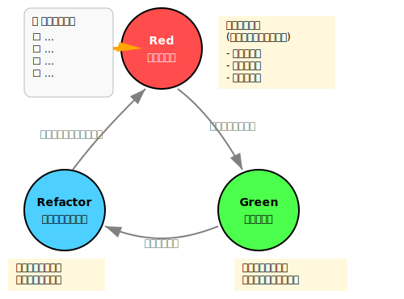

# テスト駆動開発（TDD）とは
テスト駆動開発（Test-Driven Development, TDD）は、ソフトウェア開発の手法の一つで、テストを先に書いてから実装を行うアプローチです。具体的には、「失敗するテストを書く」→「テストが通るコードを書く」→「コードをリファクタリングする」というサイクルを繰り返します。

つまり、「先にテストを書き、そのテストを満たすように最小のコードを書き、リファクタリングする」反復型の設計・開発手法ということです。

正しく行うことで、堅牢・保守しやすく・バグの少ないコードが書けるようになります。


## TDDの基本サイクル（Red-Green-Refactor）
このサイクルは TDD の中心的な考え方であり、各ステップを短時間で繰り返すことで、確実に動作するコードを積み重ねていくことができます。

### TDDは、以下の短い反復ループで進めていきます。

1. テストリスト（TODOリスト）を作成する:  
想定される仕様や振る舞いをテスト項目として書き出す
2. `テストリストから1つ選び、失敗するテストを書く（Red🔴）`
3. `テストを通す最小の実装を書く（Green🟢）`
4. `動作を変えずにコードを改善する（Refactor🔵）`
5. このサイクルを繰り返す

#### TDDのサイクル図
以下は、Red→Green→Refactor の流れを視覚的に表現したものです。



#### TDDサイクルの各フェーズ内容一覧
次の表は、それぞれのフェーズで何を目的にし、どのような観点でコードやテストを書くかをまとめたものです。

|フェーズ|目的|内容|手法・考え方|
|--:|---|---|---|
|Red 🔴|要求を定義する|まず失敗するテストを書く<br>（まだ実装していないので失敗するのが正しい）|<ul><li>未定義の関数から書く</li><li>異常系から書く</li><li>境界値を攻める</li></ul>|
|Green 🟢|最小で動かす|テストを通すために最小限の実装を行う<br>（動かすだけ）|<ul><li>明確な実装</li><li>仮実装</li><li>三角測量</li></ul>|
|Refactor 🔵|動作を保ったまま改善する|動作を変えずにコードを整理する<br>（リファクタリング）|<ul><li>命名改善・抽出・共通化</li><li>設計パターン導入</li><li>テストの整理</li></ul>|


## TDDの実施例（閏年計算）
それでは、具体的な実施例を通じて、TDDの進め方を見ていきましょう。
ここでは、「閏年かどうかを判定する関数」を例にします。

### 1. テストリスト（TODOリスト）を作成
```ts
/** 
 * ストーリーレベル（概要）
 * - 西暦を指定し、閏年かどうか判定する
 * 
 * テストリストに分解して、Red → Green → Refactor を繰り返す
 * - [ ] 閏年であることを検出
 * - [ ] 閏年ではないことを検出
 * - [ ] 100で割り切れるが400で割り切れない年は閏年ではないことを検出
 * - [ ] 400で割り切れる年は例外的に閏年であることを検出
 * - [ ] 西暦は元年からなので、0より小さい年を指定した場合は、閏年ではないこととする
 */
```


### 2. Red　🔴　: テストコードを書く
まず、失敗するテストを書きます。これは新しい機能や修正したいバグを明確に定義します。

#### テストコード `tests/leap-year.test.ts`
```ts
import { isLeapYear } from '../src/utils/leap-year';
describe('Leap algorithm', () => {
  it('閏年であることを検出', () => {
    expect(isLeapYear(2024)).toBeTruthy();
  });
  it('閏年ではないことを検出', () => {
    expect(isLeapYear(2025)).toBeFalsy();
  });
  it('100で割り切れるが400で割り切れない年は閏年ではないことを検出', () => {
    expect(isLeapYear(2100)).toBeFalsy();
  });
  it('400で割り切れる年は例外的に閏年であることを検出', () => {
    expect(isLeapYear(2400)).toBeTruthy();
  });
  it('0年は存在せず、閏年ではないこととする', () => {
    expect(isLeapYear(0)).toBeFalsy();
  });
  it('紀元前は現在の西暦に変換できず、閏年ではないこととする', () => {
    expect(isLeapYear(-4)).toBeFalsy();
  });
});

```

- このテストは実行すると必ず失敗します（まだ実装していないため）
- 何を実装するべきかの明確な要件として機能します

#### テスト結果
未だ実装されていないので、当然テストの結果は失敗します。
```sh
 RERUN  src/utils/leap-year.ts x31 

 ❯ tests/leap-year.test.ts (6 tests | 6 failed) 4ms
   × Leap algorithm > 閏年であることを検出 3ms
     → (0 , isLeapYear) is not a function
   × Leap algorithm > 閏年ではないことを検出 0ms
     → (0 , isLeapYear) is not a function
   × Leap algorithm > 100で割り切れるが400で割り切れない年は閏年ではないことを検出 0ms
     → (0 , isLeapYear) is not a function
   × Leap algorithm > 400で割り切れる年は例外的に閏年であることを検出 0ms
     → (0 , isLeapYear) is not a function
   × Leap algorithm > 0年は存在せず、閏年ではないこととする 0ms
     → (0 , isLeapYear) is not a function
   × Leap algorithm > 紀元前は現在の西暦に変換できず、閏年ではないこととする 0ms
     → (0 , isLeapYear) is not a function
                      ...
```

### 3. Green 🟢: 最小限の実装コードを書く
テストが通るように、最小限の実装コードを書きます。

#### 最小限の実装コード `src/utils/leap-year.ts`
```ts
/* Green Code */
export const isLeapYear = (year: number): boolean =>
  year <= 0 ? false : year % 400 === 0 || (year % 4 === 0 && year % 100 !== 0);

```

- この段階では、コードの美しさよりも「とにかく動くこと」を優先します
- テストが通れば成功です

#### テスト結果
```sh
RERUN  src/utils/leap-year.ts x32 

 ✓ tests/leap-year.test.ts (6 tests) 2ms
   ✓ Leap algorithm > 閏年であることを検出 1ms
   ✓ Leap algorithm > 閏年ではないことを検出 0ms
   ✓ Leap algorithm > 100で割り切れるが400で割り切れない年は閏年ではないことを検出 0ms
   ✓ Leap algorithm > 400で割り切れる年は例外的に閏年であることを検出 0ms
   ✓ Leap algorithm > 0年は存在せず、閏年ではないこととする 0ms
   ✓ Leap algorithm > 紀元前は現在の西暦に変換できず、閏年ではないこととする 0ms

 Test Files  1 passed (1)
      Tests  6 passed (6)
   Start at  12:37:19
   Duration  7ms

 PASS  Waiting for file changes...
       press h to show help, press q to quit

```

### 4 .Refactor 🔵: 実装をリファクタリングする
コードの品質を向上させるために、実装をリファクタリングします。

#### リファクタリングコード　 `src/utils/leap-year.ts`
```ts
/* Code after refactoring */
const isDivisibleBy = (year: number, divisor: number) => year % divisor === 0;

export const isLeapYear = (year: number): boolean => {
  return year <= 0
    ? false
    : isDivisibleBy(year, 400) ||
        (isDivisibleBy(year, 4) && !isDivisibleBy(year, 100));
};

```

- テストが引き続き通ることを確認しながら、コードを整理します
- 重複の排除、命名の改善、パフォーマンスの向上などを行います

#### テスト結果
```sh
RERUN  src/utils/leap-year.ts x32 

 ✓ tests/leap-year.test.ts (6 tests) 2ms
   ✓ Leap algorithm > 閏年であることを検出 1ms
   ✓ Leap algorithm > 閏年ではないことを検出 0ms
   ✓ Leap algorithm > 100で割り切れるが400で割り切れない年は閏年ではないことを検出 0ms
   ✓ Leap algorithm > 400で割り切れる年は例外的に閏年であることを検出 0ms
   ✓ Leap algorithm > 0年は存在せず、閏年ではないこととする 0ms
   ✓ Leap algorithm > 紀元前は現在の西暦に変換できず、閏年ではないこととする 0ms

 Test Files  1 passed (1)
      Tests  6 passed (6)
   Start at  12:37:19
   Duration  7ms

 PASS  Waiting for file changes...
       press h to show help, press q to quit

```

## TDDのメリット
このように、TDDを正しく実践することで、次のような多くの利点を得ることができます。

|観点|内容|
|---|---|
|設計の明確化|テストを書くことで仕様が明示され、無駄・矛盾が減る|
|バグの早期発見|コードの各部分がテストされるため、バグをすぐに発見できます|
|テスト容易な設計になる|疎結合・単一責任の構造になりやすい|
|リファクタリングしやすくなる|テストが動作保証してくれるため、安心して整理できる|
|ドキュメンテーション|テストがコードがどのように動作すべきかを示す生きたドキュメントになります|
|集中力の向上|一度に小さなタスクに集中できるため、複雑な問題でも取り組みやすくなります|


## TDDが特に効果的な場面
すべての開発でTDDを使う必要はありませんが、特に以下のような場面で効果を発揮します。

- 複雑なドメインロジック（例：税計算、割引条件、状態遷移など）
- ロジック層とUI層の分離ができる構造（SPA / APIなど）
- テストファーストでないと設計が難しい新機能
- 高い信頼性が要求される機能（認証、署名、課金、など）


## よくある誤解
ただし、TDDにはいくつかの誤解もつきものです。  
ここでは代表的な誤解と実際の姿を対比して紹介します。

|誤解|実際は…|
|---|---|
|テストが先だと非効率|実際は後戻りが少なくなり、全体効率が上がる|
|テストを書くのが面倒|テストしやすい設計になることで、将来的な工数が大幅に減る|
|すべてのコードにTDDすべき|UIなどTDDに不向きな部分もある（ロジック部分に集中する）|


## 実践的なTDDのヒント
TDDをうまく取り入れるためには、いくつかの工夫が有効です。  
以下に、日々の実装で活かせるヒントを挙げます。

|ヒント|説明|
|---|---|
|小さなステップで進める|一度に大きな機能を実装しようとせず、小さな機能ごとにサイクルを回します|
|テストケースを慎重に選ぶ|エッジケースや境界値の検証など、重要なテストケースを考慮します|
|モックとスタブを活用する|外部依存がある場合は、モックやスタブを使ってテストを分離します|
|継続的な改善|TDDの習慣は時間をかけて身につけるものです。最初は難しく感じても継続することが大切です|
|リファクタリングを怠らない|「Green」のステップで通過した後は、必ずリファクタリングを行います|


## TDDの難しさと対策
一方で、TDDには慣れが必要であり、初学者がつまずきやすいポイントも存在します。  
そうした難しさに対する具体的な対策を紹介します。

|難しさ|対策|
|---|---|
|初めての学習コスト|最初は開発速度が落ちるように感じるかもしれませんが、習熟すると生産性が向上します|
|テスト可能な設計の難しさ|テスト可能なコードを書くには、依存関係の分離など設計スキルが必要です|
|レガシーコードでの適用|既存のテストがないコードベースにTDDを導入するのは難しいですが、新規コードや修正部分から徐々に適用できます|
